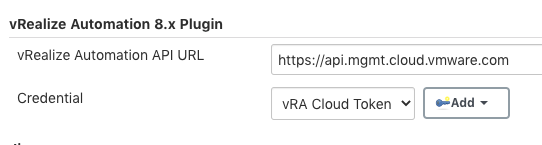

# VMware vRealize Automation Plugin for Jenkins

## Introduction

This plugin lets you create, manage and destroy virtual machines, networks, load balancers
and other resources managed by [vRealize Automation 8.x](https://www.vmware.com/products/vrealize-automation.html). 

The plugin is currently focused on pipelines rather than freestyle project. If you see
a need for support for freestyle, please open an issue and we will put that on the 
roadmap for future development.

## Getting started

Install the plugin, either by selecting it from the plugin library in Jenkins (coming soon)
or by uploading the HPI file. 

In your application repository, create a ```Jenkinsfile``` with contents similar to this:

```groovy
node {
    // Submit a deployment request and wait for it complete
    def deployment = vraDeployFromCatalog(
            catalogItemName: '<catalog item name>',
            count: 1,
            deploymentName: 'Jenkins-#',
            projectName: '<project name>',
            reason: 'I have my reasons!',
            timeout: 300,
            version: '2',
            inputs: '{ username: \'testuser\' }')
    assert deployment != null

    // Wait for the machine to receive a valid IP address. 
    def addr = vraWaitForAddress(
            deploymentId: deployment[0].id,
            resourceName: '<name of a machine within the blueprint>')
    echo "Deployed: $deployment[0].id, addresses: ${addr}"
}
```

That's it! Create a pipeline project in Jenkins that's linked to your repository, and you 
can start using it.

You have now deployed a machine and received an IP address for it. You may 
use it for SSH steps etc.

## Authenicating with vRealize Operations
There are two authentication mechanism available: API key or username/password. The latter
only works for on-premises deployments of vRealize Automation and does NOT work for the SaaS
form factor.

### API token authentication
A vRealize Automation API token is simply an Oauth refresh token and is typically valid for
six months. It is obtained in different ways depending on whether you are using the SaaS/Cloud
form factor or an on-premises deployment of vRealize Automation.

#### vRealize Automation Cloud (SaaS)
1. Click on the dropdown in the upper right corner (your user name).
2. Select "My Account"
3. Select the "API Tokens" tab
4. Click "Generate Token" and assign the appropriate roles
5. Make a note of the API token. This is the only time it will be visible!

#### vRealize Automation On-Premises
The API token isn't available in the UI with the on-premises form factor, but can be
obtained through a REST call using e.g. cURL:

```bash
curl --location --request POST 'https://<vRA8.1-URL>/csp/gateway/am/api/login?access_token' \
--header 'Content-Type: application/json' \
--data-raw '{
	"username": "username",
	"password": "password",
	"domain": "System Domain | AD Domain"
}'
```

The API token is returned in the ```refresh_token``` JSON field of the response.

### Authentication using username/password
Since the API token isn't readily available in the on-premises form factor, we also
provide username/password authentication. Please note that this is available *only* for
the on-premises form factor.

To use username/password authentication, provide the ```username```, ```password``` and
```domain``` parameters that are available for all steps.

## Global settings
This plugin allows you to configure the address of the vRealize Automation environment, 
the API key, as well as username and password if the API key isn't used. This is useful when you're only interacting with a single 
instance of vRealize Automation and allows you to omit address and credentials from the 
actual  pipelines. The credentials are configured as a reference to a standard Jenkins 
string credential or username/password credential (only available for on-premises vRealize
Automation)



## Available pipeline steps
* [vraDeleteDeployment - Delete a deployment and its resources](docs/vraDeleteDeployment.md)
* [vraDeployFromCatalog - Deploy from a catalog item](docs/vraDeployFromCatalog.md)
* [vraGetDeployment - Get details about a deployment](docs/vraGetDeployment.md)
* [vraGetResourceActionDetails - Get detailed metadata for a specific resource action](docs/vraGetResourceActionDetails.md)
* [vraGetResourceActions - Get summarized metadata all actions of a resource](docs/vraGetResourceActions.md)
* [vraRunAction - Run a day two operation](docs/vraRunAction.md)
* [vraWaitForAddress - Wait until a resource has a valid address and return it](docs/vraWaitForAddress.md)

## Javadoc
[Javadoc](https://prydin.github.io/vrealize-automation-plugin-for-jenkins/apidocs/)

## Contributing

We strongly encourage contributions to this project and would love to include your code and ideas!
For details, please refer to [CONTRIBUTING.md](CONTRIBUTING.md)

